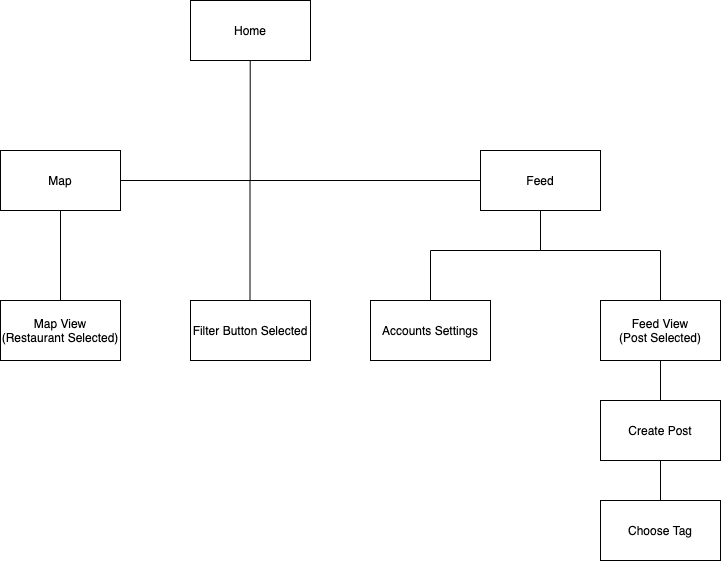
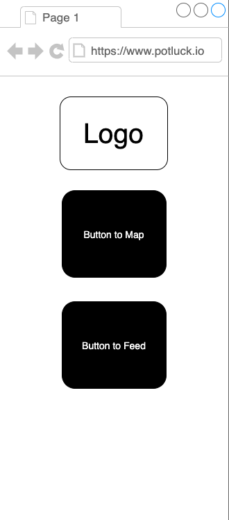
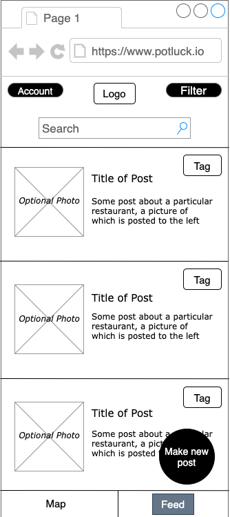
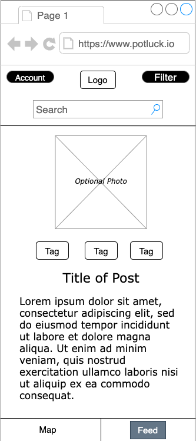
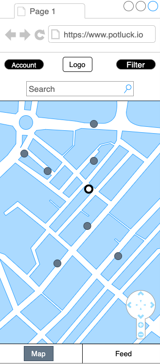
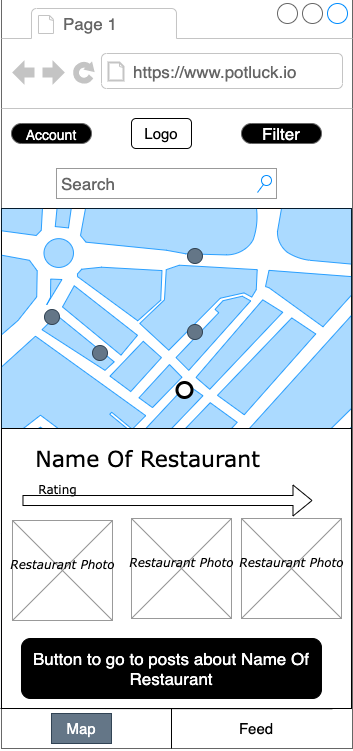
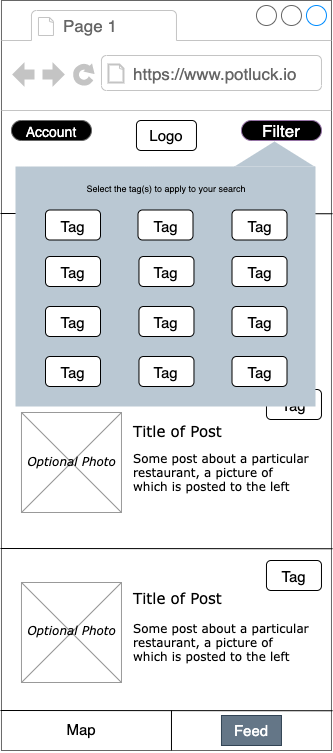
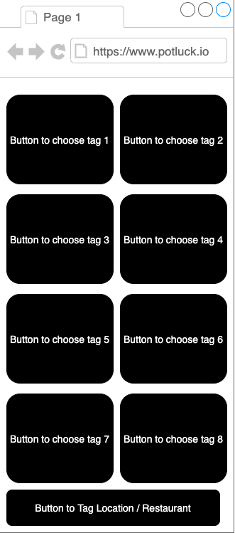
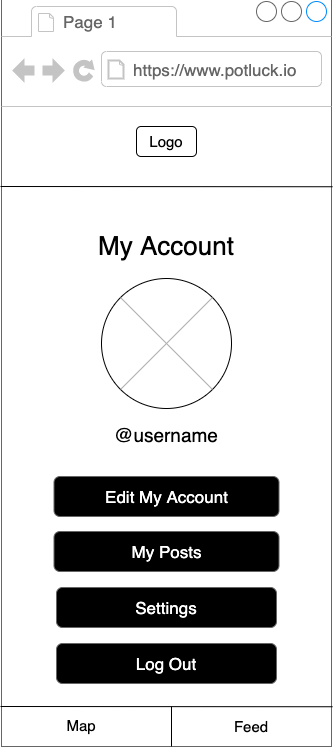

# User Experience Design
Team Huntington Explicit (PotLuck)

## Prototype
View our prototype here. [need to insert link]

## App Map & Wireframes
### App Map

### Wireframe
#### Home

Default start page. Includes logo, button that takes user to the feed (social media) view, and button that takes user to the map view).

#### Feed

The main page of the feed (social media) view for a user. Header includes account button (takes user to "Account Overview" page), logo, and filter button (lets user choose filters). Contains search bar where user can use keywords to search through posts. Contains button for user to make a new post (takes user to "Make New Post" page). Contains footer of feed view button (selected) and map view button. The main component of the page is a list of posts that a user can scroll through, and choose to select a post to view if user wishes.

#### Feed - Post Selected to View

Page that results when a user selects a specific post to view. Displays standard header and footer. Shows post's title, photo (if included), tags, and post text content.

#### Map

The main page of the map view for a user. Displays standard header and footer. Contains map with locations represented as dots of one color, which user can click on. Clicking on a location takes user to the "Map - Restaurant Selected" page. Also displays user's current location. Contains controller for user to navigate the map (move around, zoom, etc).

#### Map - Restaurant Selected to View

Page that results when a user selects a specific restaurant to view from the map. Displays standard header and footer. Shows the name of the location, its rating, photos, and a button to view posts about the location (this takes users to a feed view with a specific filter for that restaurant).

#### Filter Selected

Page that results when a user selects the filter button (on the feed or map view). A box (as shown in picture) pops up, where users can select multiple tags that they want to apply to the current page they're viewing.

#### Make Post

Screen for the user to write up a post. The user has options to add photos, select tags, and choose a location. The user can choose to post or delete the draft.

#### Choose Tags

Screen for the user to choose tag(s). The user can scroll down to choose from an assortment of different tags

#### Account Overview

The account page for the user to see and change account information. The header shows the app’s logo. The top half of the screen displays the user’s name and picture. The bottom half of the screen displays options to edit the user’s account, see the user’s posts, access settings, and log out. The footer contains links to the Map and the Feed

